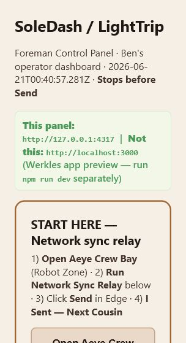
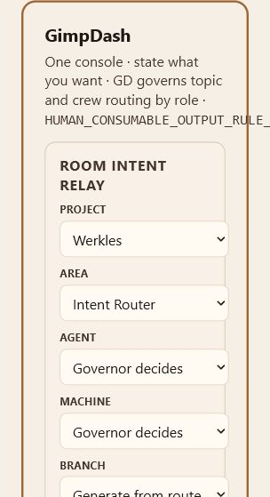
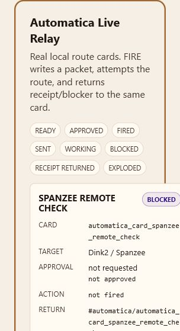
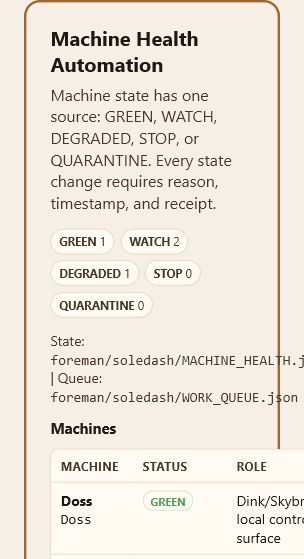

# Werkles Branch Salvage Audit

TO: Swanson@Doss

DESTINATION: TinkerDen Intake

ASSIMILATION DESTINATION: Speaker

Audit branch: `audit/branch-salvage-map-2026-06-21-180250`

Generated from Doss on 2026-06-21.

## Purpose

This branch is an audit-only review surface. It does not merge product code from the salvage branches, does not delete anything, and does not clean the Doss working tree.

The goal is to give Ben one GitHub branch where the current branch map, machine capture status, screenshots, and salvage recommendation can be reviewed.

## Safety Boundaries

- No product-code merge was performed.
- No branch was deleted.
- No working-tree cleanup was performed.
- The Doss dirty working tree was read and recorded, not modified.
- Non-Doss machine states remain `CAPTURE_REQUIRED` unless backed by current local readback.
- Preserve every branch until Petra issues GO.

## Best Current Answers

- Best Werkles / SoleDash base candidate: `origin/snapshot/sally-good-werkles-2026-06-12`
- Best SoleDash mobile candidate: `origin/salvage/betsy/snapshot/sally-good-werkles-2026-06-12`
- Best TinkerDen / Den candidate: `origin/cursor/goop-cycle-pvp-9b25`
- Newly observed preview branch during final fetch: `origin/preview/wonka-den-safe-preview-20260618`
- Canonical GitHub baseline: `origin/main` at `0c727a2461f274f8990063ab9ee06b799a1890ed`
- Kill recommendation: none before Petra GO

## Machine Capture Status

| Reality | Capture status | Review note |
| --- | --- | --- |
| Doss | CAPTURED | Local dirty working tree, local branch, remote refs, screenshots, and previews captured. |
| Betsy | PARTIAL | GitHub salvage branch captured. Betsy-local worktree status remains `CAPTURE_REQUIRED`. |
| Sally | PARTIAL | GitHub rescue branch and stale topology facts captured. Sally-local worktree status remains `CAPTURE_REQUIRED`. |
| Spanzee | BLOCKED | No Git worktree captured. Doss SoleDash reports Spanzee Remote Check blocked. |
| GitHub | CAPTURED | Visible remote refs and divergence from `origin/main` captured. |
| Vercel | PARTIAL | Public production screenshot captured. Production commit remains `UNVERIFIED` without authenticated Vercel inspect. |

## Review Files

- `branch_salvage_audit_tinkerden_intake.md` - human-readable salvage map.
- `ref_inventory.tsv` - local and GitHub-visible refs from Doss after final fetch.
- `github_remote_divergence_from_main.tsv` - every GitHub remote branch compared with `origin/main`.
- `all_visible_branches_from_doss.txt` - raw `git branch --all --verbose --no-abbrev` output.
- `doss_worktree_status.txt` - raw Doss dirty working-tree status.
- `all_refs_recent_log.txt` - recent decorated log across visible refs.
- `machine_capture_status.json` - machine-by-machine audit status.
- `screenshots/` - Vercel and Doss SoleDash/Foreman screenshots.

## Screenshot Index

## Safe Next Step

Review this branch on GitHub first. Then capture Betsy, Sally, and Spanzee local worktrees directly before any consolidation merge. After that, create reviewed pull requests by smallest salvage unit.

