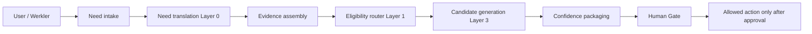

# Werkles Matching Architecture v1

Status: **v1 design draft** — schema and routing architecture only.

**Scope:** Logical data model, pipeline stages, and routing boundaries.  
**Out of scope:** UI, deployment, production schema apply, ranker training, learned models.

**Parent law:**

- `company/WERKLES_CONSTITUTION.md` — trust, money, Iron Firewall, Worker protection
- `company/WERKLES_MATCHING_RULES.md` — explainable match law (Article VII)
- `company/WERKLES_MATCH_STACKING_AND_NEED_TRANSLATION_V0.md` — Layer 0 + five-layer stack
- `company/WERKLES_TRUST_AND_COMPLIANCE.md` — verification receipts, zero-knowledge posture
- `foreman/reviews/MATCH_STACK_SCHEMA_AUDIT_V0.md` — current codebase gap audit
- `foreman/HUMAN_GATES.md` — authority stops

Werkles is a **need-translation and formation system**. Matching is one internal mechanism. v1 architecture routes a **User** through **Need** and **Evidence** to **Candidate matches**, then surfaces **Confidence** before any **Human Gate**.

---

## 1. Design entities

v1 treats every matchable thing as a **`match_entity`** with a typed kind. People are first-class; non-person sources are explicit so the engine does not collapse “find money” into “find a Backer person” by default.

| Kind | `entity_kind` | Role in matching | Notes |
|------|---------------|------------------|-------|
| **People** | `person` | Werklers, advisers, operators, connectors | Links to `profiles.id`; lane-aware |
| **Companies** | `company` | Employers, vendors, operators-at-scale, acquisition targets | Not users; may sponsor only under Sponsored Anvil rules |
| **Equipment** | `equipment` | Tools, vehicles, machines, lease/rent objects | Often pairs with Builder/Operator needs |
| **Capital sources** | `capital_source` | Funds, angels, family offices, grant programs, CDFIs | **Not** transaction broker; fit + disclosure only |
| **Education sources** | `education_source` | Courses, apprenticeships, certs, trade schools | Path before “find a person” when skill gap is real |
| **Banks** | `bank` | Deposit/lending institutions | **Infrastructure vendor class** — never Sponsored Anvil |
| **Credit unions** | `credit_union` | Member-owned lending/deposit | Same infrastructure rules as banks |
| **Service providers** | `service_provider` | Accountants, lawyers, insurers, payroll, field services | May be Sponsored Anvil with disclosure |

**Constitutional constraints (carry into schema):**

- Werkles does not hold, move, or escrow user funds.
- Banks/credit unions are reference entities for fit and education — not paid placement inventory.
- Service providers may carry `sponsored_disclosure_required` but cannot override match integrity.
- Users do not verify each other; platform verifies via providers and stores **receipts**, not raw sensitive documents.

---

## 2. End-to-end pipeline



| Stage | Question | v1 behavior |
|-------|----------|-------------|
| **User** | Who is asking, in what lane, with what blueprint context? | Read `profiles` + optional `blueprint_id` |
| **Need** | What do they think they need? | Persist `user_need` (stated); never rank on stated need alone |
| **Evidence** | What proof and context exist? | Attach verification receipts, badges, self-reported fields with strength tiers |
| **Candidate matches** | What typed entities could help? | Generate ranked `match_candidate` rows per eligible `entity_kind` |
| **Confidence** | How sure is the system, and why? | Band + explainable `factors` json; never opaque score-only |
| **Human Gate** | What requires Operator/user authority? | Intro, Lock the Joints, provider spend, schema, deploy — per `HUMAN_GATES.md` |

**Anchor rule:** Stated need is the user's anchor. Translated need widens the candidate **kinds** and **paths**; it does not silently discard the anchor.

---

## 3. Logical schema (design only)

Notation: types and tables below are **architecture targets**, not approved migrations. Apply only through a future human-gated migration packet.

### 3.1 Enums

```text
entity_kind:
  person | company | equipment | capital_source | education_source
  bank | credit_union | service_provider

need_category:
  capital | operator | builder | connector | equipment | education
  banking_relationship | service | proof | distribution | crew | other

evidence_kind:
  identity_receipt | funds_receipt | license_receipt | employment_receipt
  reference_receipt | artifact | self_report | third_party_record

evidence_strength:
  verified_strong | verified_weak | self_reported | missing | expired

confidence_band:
  low | medium | high | insufficient_data

candidate_status:
  proposed | surfaced | intro_requested | gated_pending
  approved | declined | expired | blocked

human_gate_kind:
  intro_approval | lock_joints | provider_action | counsel_review
  schema_change | spend | public_exposure
```

### 3.2 Core identity graph

```text
match_entities
  id                uuid PK
  entity_kind       entity_kind NOT NULL
  display_name      text NOT NULL
  slug              text UNIQUE
  status            active | draft | archived
  geography         jsonb          -- metro, state, remote_ok, turf
  visibility        public | members | gated
  trust_tier        server_derived -- never client-writable
  sponsored_flag    boolean DEFAULT false
  infrastructure_flag boolean DEFAULT false  -- true for bank/credit_union
  source_ref        text           -- curator, import batch, user_submitted
  created_at        timestamptz
  updated_at        timestamptz

entity_person_links
  entity_id         uuid FK → match_entities
  profile_id        uuid FK → profiles
  UNIQUE (entity_id, profile_id)

entity_company_profiles
  entity_id         uuid PK FK → match_entities
  legal_name        text
  industry_tags     text[]
  stage_band        text
  employee_band     text

entity_equipment_profiles
  entity_id         uuid PK FK → match_entities
  equipment_class   text
  availability      text
  location          jsonb

entity_capital_source_profiles
  entity_id         uuid PK FK → match_entities
  instrument_types  text[]       -- equity, debt, grant, revenue_share_off_platform
  check_size_band   text         -- band only, never raw balances
  domain_tags       text[]

entity_education_source_profiles
  entity_id         uuid PK FK → match_entities
  credential_types  text[]
  delivery_mode     text
  duration_band     text

entity_bank_profiles
  entity_id         uuid PK FK → match_entities
  charter_type      bank | credit_union  -- redundant guard with kind
  product_families  text[]               -- checking, loc, sba_referral, etc.
  infrastructure_only boolean DEFAULT true

entity_service_provider_profiles
  entity_id         uuid PK FK → match_entities
  service_categories text[]
  license_refs      text[]
  sponsored_disclosure_id uuid NULL
```

**Person bootstrap:** Every `profiles` row may auto-materialize a `match_entities` row with `entity_kind = person` for uniform candidate joins. Existing blueprint RPC can continue to target people while v1 routing adds non-person kinds in parallel.

### 3.3 Need and translation

```text
user_needs
  id                uuid PK
  user_id           uuid FK → profiles
  blueprint_id        uuid NULL FK → blueprints
  stated_need_text  text NOT NULL
  need_categories   need_category[] NOT NULL
  preferred_entity_kinds entity_kind[]  -- optional user hint
  urgency           low | normal | high
  capacity_band     text
  status            open | translated | matching | closed
  created_at        timestamptz

need_translations
  id                uuid PK
  user_need_id      uuid FK → user_needs UNIQUE
  translated_summary text NOT NULL
  bottleneck_hypothesis text
  recommended_entity_kinds entity_kind[]
  alternative_paths jsonb     -- [{path, rationale, confidence_band}]
  layer0_version    text
  translation_mode  manual | rules | assisted  -- assisted = gated provider
  reviewed_by       uuid NULL
  created_at        timestamptz
```

### 3.4 Evidence

```text
evidence_items
  id                uuid PK
  subject_entity_id uuid FK → match_entities  -- usually person or company
  evidence_kind     evidence_kind
  strength          evidence_strength
  source_system     crucible | stripe_identity | plaid | checkr | manual
  receipt_id        uuid NULL FK → verification receipts table
  summary           text          -- human-readable, no raw PII
  expires_at        timestamptz NULL
  created_at        timestamptz

need_evidence_links
  user_need_id      uuid FK → user_needs
  evidence_item_id  uuid FK → evidence_items
  link_role         supports | contradicts | gap
  PRIMARY KEY (user_need_id, evidence_item_id)
```

**Evidence assembly rule:** Candidates may not surface `confidence_band = high` when required evidence for that need category is `missing` or `expired`.

### 3.5 Candidate sets and confidence

```text
match_candidate_sets
  id                uuid PK
  user_need_id      uuid FK → user_needs
  translation_id    uuid FK → need_translations
  routing_profile   text          -- e.g. need_capital_v1
  layers_executed   int[]         -- [0,1,3] in v1; 2,4,5 deferred
  generated_at      timestamptz
  expires_at        timestamptz

match_candidates
  id                uuid PK
  set_id            uuid FK → match_candidate_sets
  target_entity_id  uuid FK → match_entities
  entity_kind       entity_kind
  rank              int
  score             numeric(5,2)  -- diagnostic, never sole output
  confidence_band   confidence_band
  factors           jsonb NOT NULL  -- explainability payload
  first_step        text          -- reversible, low-friction action
  status            candidate_status
  UNIQUE (set_id, target_entity_id)

match_confidence_factors
  candidate_id      uuid FK → match_candidates
  factor_key        text          -- lane_complement, proof_gap, turf_fit, etc.
  weight            numeric
  explanation       text
  data_quality      verified | inferred | missing
  PRIMARY KEY (candidate_id, factor_key)
```

**`factors` jsonb shape (contract):**

```json
{
  "headline": "Capital band overlap; customer validation gap remains",
  "need_fit": { "stated_anchor": "...", "translated_widen": ["education_source", "service_provider"] },
  "proof": { "cleared": ["identity_receipt"], "missing": ["funds_receipt"] },
  "friction": { "first_step": "20-minute deck review", "reversible": true },
  "constitutional_flags": { "infrastructure_only": false, "sponsored_disclosure": null }
}
```

### 3.6 Human gates

```text
match_human_gates
  id                uuid PK
  candidate_id      uuid NULL FK → match_candidates
  set_id            uuid NULL FK → match_candidate_sets
  gate_kind         human_gate_kind
  gate_tier         tier1 | tier2
  status            pending | approved | declined | expired
  required_actor    user | operator | counsel
  blocking_reason   text
  approval_ref      text NULL       -- APPROVAL_LOG pointer
  created_at        timestamptz
  resolved_at       timestamptz NULL
```

**v1 default:** Surfacing candidates is **non-gating**. Requesting intro, Lock the Joints, or any provider-touching action creates a `match_human_gates` row and stops automation.

---

## 4. Routing architecture

Routing is **need-category → entity-kind → layer module**. v1 uses deterministic rules and SQL RPCs; no learned ranker.

### 4.1 Router modules

| Module | Layer | Input | Output | Runtime home |
|--------|-------|-------|--------|--------------|
| `need-intake` | — | user_id, stated_need | `user_needs` row | API route / server action |
| `need-translator` | 0 | user_need + profile + evidence summary | `need_translations` | rules engine v1; provider assist gated |
| `evidence-assembler` | — | user_id, blueprint_id | evidence link set | Crucible + badge readers |
| `eligibility-router` | 1 | translation + entity_kind | eligible entity id list | SQL per kind |
| `quality-throttle` | 2 | **deferred v1** | — | future |
| `compatibility-scorer` | 3 | eligible ids + need context | scored candidates | extend `match_candidates_for_blueprint` pattern |
| `confidence-packager` | — | raw scores + evidence gaps | `confidence_band` + `factors` | SQL + TypeScript formatter |
| `human-gate-router` | — | candidate action intent | `match_human_gates` | server-only |
| `preference-resolver` | 4 | **deferred v1** | — | intro flow partial today |
| `cohort-builder` | 5 | **deferred v1** | — | blueprint seats only |

### 4.2 Need category → entity kind routing table

| `need_category` | Primary entity kinds (search order) | Secondary kinds | Do not default to |
|-----------------|-------------------------------------|-----------------|-------------------|
| `capital` | `capital_source`, `person` (Backer lane) | `bank`, `credit_union`, `service_provider` | single Backer person without proof bands |
| `operator` | `person` (Operator lane), `company` | `service_provider` | generic Connector |
| `builder` | `person` (Builder/Spark lane) | `equipment`, `education_source` | — |
| `equipment` | `equipment`, `service_provider` | `company` | person match |
| `education` | `education_source` | `service_provider`, `person` (mentor) | paid course sponsorship without disclosure |
| `banking_relationship` | `bank`, `credit_union` | `service_provider` (bookkeeper) | Werkles holding funds |
| `service` | `service_provider` | `company`, `person` | implied endorsement |
| `proof` | `service_provider`, `education_source` | `person` (Connector) | pay-to-play trust |
| `crew` | `person` (multi-lane) | `company` | Layer 5 cohort solver |
| `distribution` | `person` (Connector), `company` | `service_provider` | — |

Each route invokes **kind-specific eligibility SQL** then merges into one `match_candidate_set`.

### 4.3 RPC boundaries (target)

```text
match_route_need(p_user_need_id) → match_candidate_set_id
  -- orchestrates translator → evidence → eligibility → score → confidence

match_eligible_entities(p_need_id, p_entity_kind) → set<entity_id>
  -- boolean hard filters only (Layer 1)

match_score_candidates(p_need_id, p_entity_ids[]) → ranked rows
  -- weighted compatibility (Layer 3); explainable factors required

match_package_confidence(p_candidate_rows[]) → confidence_band + factors json
  -- never return raw financial ranges
```

**Existing scaffold:** `public.match_candidates_for_blueprint(...)` remains the **person / blueprint** compatibility path until v1 routers subsume it behind `match_route_need`.

### 4.4 Read vs write paths

| Path | Who writes | Who reads |
|------|------------|-----------|
| User stated need | authenticated user | matching routers, operator consoles |
| Translation | rules engine / gated assist | match UI (future), SoleDash status |
| Evidence receipts | Crucible webhooks, server jobs | evidence-assembler (read-only join) |
| Candidate sets | server RPC only | user match deck (future) |
| Human gate resolution | Operator / user authority | audit logs, intro workflow |

All `trust_tier`, `confidence_band`, and `score` fields are **server-derived**. Clients display; they do not compute.

---

## 5. Confidence model (v1)

Confidence is **not** match probability marketing language. It is an **explainability band** tied to evidence coverage and data quality.

| Band | Meaning | Typical conditions |
|------|---------|-------------------|
| `high` | Strong fit **and** required proof present | Eligibility pass, key receipts verified, factors complete |
| `medium` | Plausible fit with gaps | Some proof missing or self-reported only |
| `low` | Speculative / educational | Translation widened path; user should treat as hypothesis |
| `insufficient_data` | Do not rank for action | Block auto-surface; prompt need or proof intake |

**Hard stops (force `low` or gate):**

- Sponsored service provider without disclosure surfaced
- Infrastructure bank/credit union presented as “recommended lender”
- Capital match without funds verification when need_category = `capital`
- Any candidate crossing production provider spend without human gate

---

## 6. Human gate map

| Action | Gate kind | Tier | v1 |
|--------|-----------|------|-----|
| View candidate cards | — | — | allowed |
| Request intro | `intro_approval` | tier2 | yes |
| Lock the Joints / blueprint advance | `lock_joints` | tier1 | yes |
| Start Crucible / provider check for match | `provider_action` | tier1 | yes |
| Apply matching schema migration | `schema_change` | tier1 | **blocked in v1 design** |
| Auto-send outreach | `public_exposure` | tier1 | **forbidden** |

Silence is not approval. Candidate `status` may not advance to `approved` without recorded gate resolution.

---

## 7. Relationship to match stack layers

| Layer | v1 architecture |
|-------|-----------------|
| **0 — Need translation** | `need_translations` + routing table widening |
| **1 — Eligibility** | Per-kind `match_eligible_entities` |
| **2 — Anti-gaming** | Documented hook only; no schema |
| **3 — Compatibility** | `match_score_candidates` + explainable `factors` |
| **4 — Two-sided preference** | Partial via intro requests; full resolver deferred |
| **5 — Cohort builder** | Blueprint multi-seat only; no crew score |

---

## 8. v1 deliverables vs exclusions

### In v1 design (this document)

- Typed entity taxonomy (8 kinds)
- Need → evidence → candidate → confidence → gate pipeline
- Logical schema and RPC routing boundaries
- Need-category routing table
- Confidence bands and factors contract
- Constitutional flags in routing (infrastructure, sponsored)

### Explicitly out of v1

- UI components
- Production migration apply
- Learned ranker or embedding retrieval
- Layer 2 anti-gaming model
- Layer 4 stable matching solver
- Layer 5 automatic crew optimization
- Hidden financial inference
- Guaranteed match claims
- Werkles holding or routing money between users

---

## 9. Safe implementation order (post-design gates)

1. **Petra GO** on schema extension for `user_needs`, `need_translations`, `match_entities` shell
2. **Rules-only Layer 0** translator (no provider LLM)
3. **Person path** — wire existing blueprint RPC through `match_route_need` facade
4. **Non-person kinds** — seed read-only catalog entities (banks, education) before scoring
5. **Confidence packager** — enforce `factors` json contract in API responses
6. **Human gate router** — intro + Lock the Joints only

Each step requires a separate lane packet in `foreman/NEXT_ACTION.md` and human gate where schema or production data is touched.

---

## 10. Speaker warning

Compressing this document into “Werkles has a matching algorithm” is **false**.

v1 architecture is a **typed formation router**: it translates needs, assembles evidence, proposes candidates across people and institutions, explains confidence, and stops at human gates.

Build around **becoming**, not static identity display.

---

## Related artifacts

- `company/WERKLES_MATCHING_RULES.md`
- `company/WERKLES_MATCH_STACKING_AND_NEED_TRANSLATION_V0.md`
- `foreman/reviews/MATCH_STACK_SCHEMA_AUDIT_V0.md`
- `supabase/migrations/00001_initial_schema.sql` — current person/blueprint scaffold
