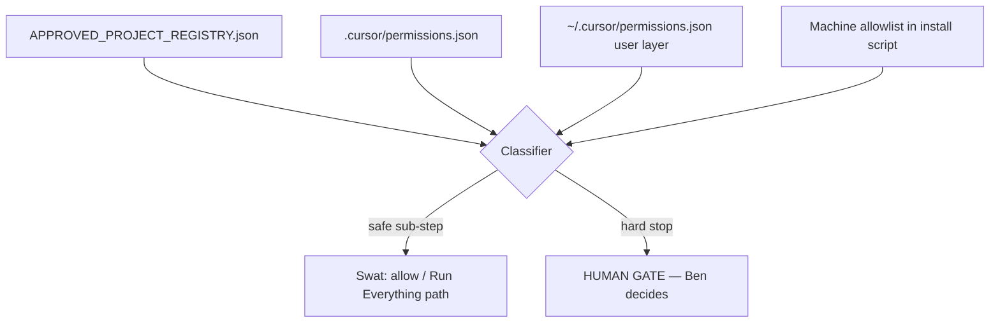

# Permission Swatter v1

Status: **cockpit doctrine + Cursor-native swatter** — Aeye Windows only.

## Purpose

When Ben has **TOTAL-approved** a project, routine permission prompts for **sub-steps inside that project** should not stall the machine. The swatter clears **low-risk, in-lane** prompts quickly. It does **not** approve money, deploy, merge, secrets, or destructive actions.

**Corvette rule:** If the prompt could crash daddy's 1954 Corvette — irreversible delete, system damage, money, production blast — **never swat**. Stop.

---

## Scope

| In scope | Out of scope |
|----------|--------------|
| Cursor Agent permission prompts on **Aeye Windows** | macOS, cloud agents, Cowork browser |
| Sally `DESKTOP-SJSJMNK`, Betsy `DESKTOP-KTBH0LA` when live-verified | Unknown hosts (Doss until proven) |
| Projects in `foreman/gates/APPROVED_PROJECT_REGISTRY.json` with `approved_total` | Unlisted work, chat-only scope |
| Sub-steps listed under each project's `allowed_substeps` | Anything in `forbidden_even_when_approved` |

**Not a security boundary.** Best-effort convenience layered on `foreman/HUMAN_GATES.md`. Cursor may still prompt; constitutional gates always win.

---

## Architecture (three layers)



### Layer 1 — Total-approved project registry

**Source:** `foreman/gates/APPROVED_PROJECT_REGISTRY.json`

Ben adds a project only when he approves **TOTAL completion** of that mission (not just one file). While status is `approved_total`, agents may treat listed substeps as **PROCEED: not a human gate** per `.cursorrules` — unless a forbidden pattern matches.

New total-approved project → append registry row → record in `foreman/gates/APPROVAL_LOG.md`.

### Layer 2 — Cursor-native swatter (primary)

Do **not** rely on fragile OS-wide auto-click bots for Cursor modals. Use Cursor's own controls:

| Mode | When to use on Aeye | Effect |
|------|---------------------|--------|
| **Run Everything** | Ben wants zero prompts; accepts full responsibility | No classifier; all tools pass through |
| **Auto-review** + `autoRun` | Default safer path | Classifier steered by `.cursor/permissions.json` |
| **Allowlist** | Narrowest | Only listed terminal prefixes auto-run |

**Recommended Aeye setup (Sally snapshot forge):**

1. **Cursor Settings → Agents → Run Mode** → **Run Everything** *or* **Auto-review**
2. Keep protections **ON**: Delete File Protection, Dotfile Protection, MCP Tool Protection (unless explicitly needed)
3. Repo file: `.cursor/permissions.json` (committed)
4. User file: `~/.cursor/permissions.json` — install via `scripts/foreman/install-permission-swatter-user.ps1`

**Known regression:** Run Mode may revert from Allow Everything / Run Everything to Allowlist. If prompts return, run `scripts/foreman/permission-swatter-status.ps1` first.

### Layer 3 — Machine gate

Swatter install script runs only on registered Aeye hostnames:

- `DESKTOP-SJSJMNK` (Sally)
- `DESKTOP-KTBH0LA` (Betsy — when Operator confirms)

Refuses unknown hosts. Does not install on Doss until hostname is proven.

---

## Classifier rules (hard stop vs swat)

### Always HARD STOP (never swat)

```text
git push, merge, force-push, deploy, vercel, render, supabase db push
sql apply, migration apply, rls, policy change
billing, stripe, payment, card, oauth, secret, api key, token, .env
npm publish, production INSERT UPDATE DELETE
rm -rf, del /s, format, shutdown, registry, driver
ghost forge paid batch without BUDGET lane
relay auto-send, Power Automate send to AI APIs
edits under C:\Users\benle\Desktop\github\Werkles rescue clone (unless Ben explicitly approves)
```

### Usually SWAT (inside approved_total project)

```text
git status, diff, log, branch, fetch, pull (not push)
npm install, npm run dev, typecheck, build, lint
read/write files in approved lane paths
foreman cockpit docs
local HTTP probe localhost:3000
launcher .cmd creation on snapshot surface
```

### Response phrases (agents)

When classifier says safe and project is `approved_total`:

```text
PROCEED: not a human gate — permission swatter v1, approved sub-step.
```

When hard stop:

```text
STOP: HUMAN GATE — outside swatter bounds.
```

Agents **must not** approve true human gates on Ben's behalf (`.cursorrules`).

---

## Sally two-clone rule

| Path | Swatter |
|------|---------|
| `C:\Dev\Werkles` (snapshot) | **Allowed** when registry + branch match |
| `C:\Users\benle\Desktop\github\Werkles` (rescue) | **Blocked by default** — do not auto-approve edits or branch switches |

---

## Operator setup (Sally snapshot)

```powershell
cd C:\Dev\Werkles
powershell -NoProfile -ExecutionPolicy Bypass -File .\scripts\foreman\permission-swatter-status.ps1
powershell -NoProfile -ExecutionPolicy Bypass -File .\scripts\foreman\install-permission-swatter-user.ps1
```

Then in Cursor: **Settings → Agents → Run Mode → Run Everything** (or Auto-review with repo `permissions.json`).

Re-run status after any Cursor update.

---

## What v1 does not do

- Click through Windows UAC for unknown installers
- Auto-approve browser OAuth or bank login
- Replace `foreman/HUMAN_GATES.md` or Petra GO on schema/deploy
- Run on non-Aeye machines
- Swat permissions for unlisted projects

Future v2 may add **read-only** prompt logging (`foreman/permission-swatter/prompt-log/`) for audit — not in v1.

---

## Related artifacts

- `foreman/gates/APPROVED_PROJECT_REGISTRY.json`
- `.cursor/permissions.json`
- `scripts/foreman/install-permission-swatter-user.ps1`
- `scripts/foreman/permission-swatter-status.ps1`
- `foreman/AI_COUSINS_PROTOCOL.md` — Cursor regression note
- `foreman/LANES.md` — lane: Cursor Permission Fix
- `foreman/HUMAN_GATES.md` — true gates
