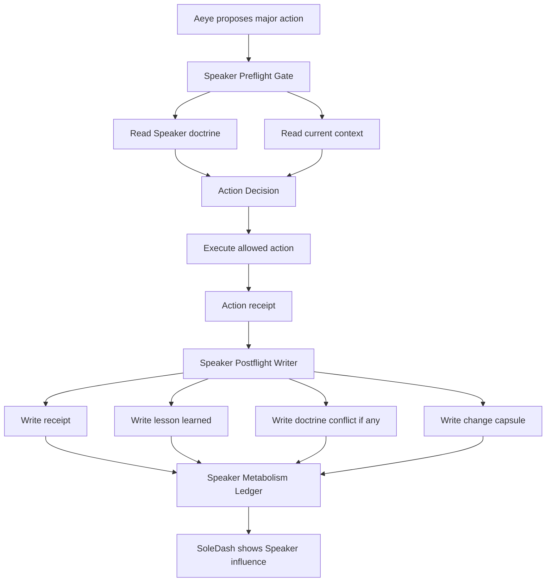
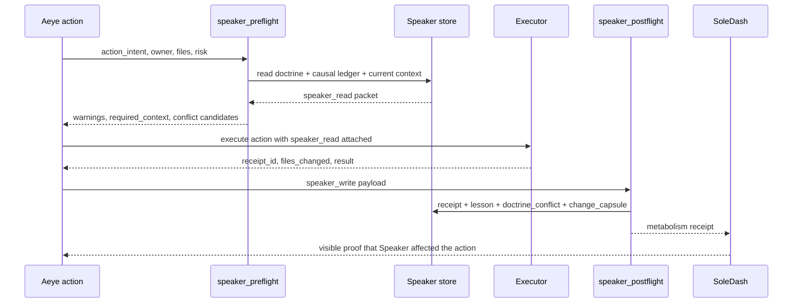

# SPEAKER_METABOLISM_V1

Status: PROPOSAL  
Reviewer: Daemon  
Return surface: SoleDash  

## Why

Speaker currently preserves causal memory, doctrine, entries, and warnings. That makes it valuable storage, but storage is not yet an organ.

An organ changes behavior. Speaker becomes an organ when every major Aeye action must read Speaker before action and write Speaker after action.

## Goal

Force every major Aeye action to interact with Speaker without violating the Speaker Charter.

Speaker still does not execute commands, route missions, deploy, ratify doctrine, or approve human gates. Speaker supplies causal memory and records metabolism receipts around action.

## Existing Speaker Surface

- `foreman/speaker/SPEAKER_CHARTER.md`
- `foreman/speaker/SPEAKER_DOCTRINE.md`
- `foreman/speaker/SPEAKER_PACKET_TEMPLATE.md`
- `foreman/speaker/CAUSAL_LEDGER.md`
- `foreman/speaker/entries/*.md`
- `foreman/speaker/speaker-lib.mjs`
- `/gd/speaker` -> Foreman `#gd-speaker`

## Architecture Diagram



## Data Flow Diagram



## Major Action Definition

Speaker metabolism is required for any action that changes one or more of:

- Aeye role boundaries
- routing or dispatch logic
- courier, relay, or handoff behavior
- doctrine, gates, or operating rules
- member-facing explanation of what Werkles does
- SoleDash / TinkerDen / Wonka Den command surfaces
- scripts that automate local work or cross-machine handoff
- any build where missing causal context would make Ben the manual memory layer

Minor cosmetic edits may skip full metabolism, but must still record `speaker_review: not_required` in the action receipt.

## Minimum Viable Loop

### Before action

1. Read `foreman/speaker/SPEAKER_DOCTRINE.md`.
2. Read `foreman/speaker/CAUSAL_LEDGER.md`.
3. Read relevant entries from `foreman/speaker/entries/*.md` by trigger match.
4. Read current action context: mission, owner, target files, branch, and known blockers.
5. Emit `speaker_read`.

### After action

1. Write ordinary action receipt.
2. Write lesson learned, even if the lesson is "no new lesson".
3. Write doctrine conflict if the action contradicted or stressed existing doctrine.
4. Write change capsule summarizing what changed and why it matters.
5. Emit `speaker_write`.

## Required Data Structure

```ts
export type SpeakerMetabolismReceipt = {
  schema: "speaker_metabolism_v1";
  action_id: string;
  actor: string;
  action_kind: string;
  speaker_read: {
    doctrine_paths: string[];
    context_paths: string[];
    matched_entries: string[];
    warnings: string[];
    decision_effect: "changed_action" | "confirmed_action" | "blocked_until_human" | "no_effect";
  };
  speaker_write: {
    receipt_path: string;
    lesson_learned: string;
    lesson_entry_path: string | null;
    doctrine_conflict_path: string | null;
    change_capsule_path: string;
  };
  receipt_id: string;
  doctrine_conflict: null | {
    conflict: string;
    doctrine_path: string;
    severity: "advisory" | "needs_review" | "human_gate";
    reviewer: "Daemon";
  };
  change_capsule: {
    what_changed: string;
    why_it_matters: string;
    who_needs_to_know: string[];
    next_action: string;
  };
};
```

## Implementation Proposal

### 1. Add Speaker metabolism library

Create `lib/speaker-metabolism/`:

- `types.ts` for `SpeakerMetabolismReceipt`.
- `read.ts` for doctrine, ledger, entry, and context reads.
- `write.ts` for receipt, lesson, conflict, and capsule writes.
- `gate.ts` for deciding whether an action is major.

The library must not execute arbitrary commands and must not ratify Speaker entries.

### 2. Add preflight wrapper for Aeye actions

Expose:

```ts
speakerPreflight({
  actionId,
  actor,
  actionKind,
  mission,
  targetFiles,
  riskTags
})
```

Returns `speaker_read` and a short `decision_effect` reason. Every major action pipeline must attach this object to the action context before execution.

### 3. Add postflight writer

Expose:

```ts
speakerPostflight({
  actionId,
  actor,
  result,
  speakerRead,
  filesChanged,
  receiptId,
  lessonLearned,
  doctrineConflict,
  changeCapsule
})
```

Writes:

- `foreman/speaker/metabolism/receipts/<receipt_id>.json`
- `foreman/speaker/metabolism/change-capsules/<receipt_id>.json`
- optional `foreman/speaker/metabolism/doctrine-conflicts/<receipt_id>.json`
- optional `foreman/speaker/entries/DRAFT_<date>-<slug>.md` when lesson is durable

### 4. Wire into first action surfaces

First wiring targets:

- `app/api/soledash/v1/wonka-den/aeye-loop/route.ts`
- `lib/soledash/aeye-inbox-v0/protocol.ts`
- `scripts/foreman/relay-courier-lib.mjs`
- `scripts/foreman/foreman-control-server.mjs` for GD/Speaker visibility

### 5. Add SoleDash visibility

SoleDash should show a Speaker metabolism strip:

- last `speaker_read`
- last `speaker_write`
- whether Speaker changed, confirmed, or warned on the action
- doctrine conflicts awaiting Daemon/Petra/Ben review
- recent change capsules

### 6. Add degradation test

Create a smoke test that runs the same representative action twice:

1. Speaker enabled.
2. Speaker disabled or unavailable.

Expected measurable degradation when Speaker is removed:

- `speaker_read.matched_entries` becomes zero.
- doctrine warnings disappear.
- action receipt lacks `lesson_learned`.
- change capsule is missing.
- SoleDash marks `SPEAKER_REVIEW_MISSING`.

## Doctrine Conflict Rules

Speaker may detect conflicts but cannot resolve them alone.

- `advisory`: action may proceed, visible warning required.
- `needs_review`: Daemon reviews before promotion.
- `human_gate`: Ben/Petra gate according to cockpit files.

No agent may ratify Speaker doctrine or Speaker entries on Ben's behalf.

## Success Criteria

Speaker is metabolizing when:

- every major action has `speaker_read`
- every major action has `speaker_write`
- every receipt has `receipt_id`
- doctrine conflicts are visible, not buried
- change capsules appear in SoleDash
- disabling Speaker makes decisions visibly worse

## First Build Slice

Build the metabolism library and wire only the Wonka Den Aeye loop first. Do not wire every action surface in one pass.

Acceptance for slice 1:

- A `BUILD HERE FIRST` / TinkerDen packet action reads doctrine and ledger before send.
- The receipt returns `speaker_read`, `speaker_write`, `receipt_id`, `doctrine_conflict`, and `change_capsule`.
- SoleDash shows the last metabolism receipt.
- Daemon can inspect the architecture and decide whether to expand to courier/GD.
