# Book Architecture Connection Map

Status: COMPANION ARTIFACT V0.1
Date: 2026-07-06
Owner: Heimerdinker@Betsy
Lane: Harvey/Nerdkle architecture review

## Purpose

This is the structural map behind the prose packet. It names the apps, runtimes, files, ledgers, gates, and proof surfaces that have to cooperate before isolated Aeyes can stop using Ben as the missing message bus.

Truth boundary: this map proves the local architecture companion exists and is indexed. It does not claim a send to Mack, a Mack return, universal receiver proof, production deployment, or solved real-time shared consciousness.

## Architecture Claim

The buildable claim is:

```text
Aeyes cooperate by sharing body-state, custody, gates, and receipts.
They do not cooperate because their context windows magically merge.
```

The system is therefore not one app and not one language. It is a governed transport between apps and languages, with receipts as the common truth layer.

## Custody Spine

```mermaid
flowchart LR
  Ben["Ben intent"]
  Cockpit["TinkerDen / SoleDash cockpit<br/>React + Next.js"]
  Api["Next.js API routes<br/>TypeScript + Node.js"]
  Canon["Contract canon<br/>packet / receipt / event / gate / boot-context"]
  Gate["Gate<br/>policy + human authority + OS boundary"]
  Relay["Packet and workspace relay<br/>Node.js + JSON"]
  Boot["Boot context<br/>Tinkarden + Wormeyes + Speaker"]
  Receiver["Receiver Aeye / machine runner<br/>Node.js + PowerShell"]
  Tools["Bounded tools<br/>Git, local files, provider dashboards, Supabase, Vercel"]
  Receipt["Receipt writer<br/>JSON + Markdown"]
  Event["Event spine<br/>Chokidar + JSONL"]
  Readback["Cockpit readback<br/>operator proof surface"]

  Ben --> Cockpit
  Cockpit --> Api
  Api --> Canon
  Canon --> Gate
  Gate --> Relay
  Relay --> Boot
  Boot --> Receiver
  Receiver --> Tools
  Tools --> Receipt
  Receipt --> Event
  Event --> Readback
  Readback --> Ben
  Receipt --> Canon
  Event --> Canon
```



## Connection Contracts

| From | To | Transport | Runtime / language | Contract | Proof required |
| --- | --- | --- | --- | --- | --- |
| Ben intent | TinkerDen / SoleDash cockpit | UI action or local packet | React, TypeScript, Next.js | Operator intent becomes a packet candidate | Visible packet preview or blocker |
| Cockpit | Next.js API routes | HTTP route handler | TypeScript on Node.js | Packet, receipt, gate, readback schemas | API response plus receipt path |
| API routes | Contract canon | Typed parse / validation | TypeScript | Shared packet, receipt, event, gate, boot-context contracts | `SCHEMA_INVALID` for bad input; valid ids join |
| Contract canon | Gate | Policy decision | TypeScript, Markdown policy, OS permission | Allowed actions, forbidden actions, stop rules | `ACK`, `BLOCKER`, or `ARTIFACT` with reason |
| Gate | Packet / workspace relay | JSON packet write or HTTP dispatch | Node.js, TypeScript | Custody transfer begins, not completion | Sender-side receipt remains pending unless receiver returns |
| Relay | Receiver Aeye / machine runner | File drop, local command, or HTTP runner | Node.js, PowerShell | Receiver loads packet and returns terminal state | Receiver-side receipt, not just filesystem custody |
| Receiver | Boot context | Local readback before action | Node.js CommonJS, JSON, Markdown | World state, source truth, Speaker bootpack, latest receipts | Stale or missing boot context blocks work |
| Receiver | Bounded tools | Local command, browser/dashboard action, API call | PowerShell, Git, browser UI, provider APIs | Lane-limited action with explicit human gates | Artifact path, command output, screenshot, or blocker |
| Bounded tools | Receipt writer | Structured file write | JSON, Markdown, JSONL | Terminal state after action or attempted action | Completed, partial, blocked, source missing, breach denied |
| Receipt writer | Event spine | File watcher append | Node.js, Chokidar, JSONL | Packet and receipt ids become joinable events | Dispatch and receipt events share ids |
| Event spine | Cockpit readback | Query or file read | Next.js, TypeScript, JSONL | Current body-state appears to Ben | One screen shows owner, state, blocker, next action |
| Cockpit readback | Ben | Human-visible proof | React, HTML, Markdown | Human can resume without reconstructing thread | Status is truthful: ready, blocked, partial, or waiting |

## App And Language Roles

| Role | App / surface | Languages | Responsibility |
| --- | --- | --- | --- |
| Operator surface | TinkerDen, SoleDash | TypeScript, React, CSS | Capture intent, show proof, expose next legal action |
| Routing API | Next.js route handlers | TypeScript, Node.js | Validate packets, write receipts, expose readback endpoints |
| Local operator hands | Foreman scripts | PowerShell, Node.js | Run safe local commands, status refreshes, smokes, and receipts |
| Event spine | Chokidar watcher | Node.js, JSONL | Turn file-backed changes into normalized body-state events |
| Shared boot | Tinkarden nervous system | Node.js CommonJS, Markdown, JSON | Compile world state and doctrine before Aeye action |
| Context memory | Speaker | Markdown, JSONL | Preserve lessons without becoming executor or source truth |
| Reality sensor | Wormeyes | Node.js, JSON | Report machine, repo, branch, ports, staleness, and blockers |
| Product state | Supabase | SQL, TypeScript | Durable indexed product state when local files are not enough |
| Secret custody | 1Password | PowerShell, op refs | Keep secrets outside chat, logs, and source files |
| Deployment | Vercel | Next.js, Node.js | Host public surfaces only after explicit gate |
| Source custody | Git / GitHub | Git | Preserve diffs, history, branch truth, and promotion decisions |
| Review artifacts | Markdown, DOCX, HTML | Markdown, OOXML, HTML | Give Ben and Mack human-readable review surfaces |

## Real Today

- The packet/receipt/gate/event/boot-context contract canon exists locally and has smoke proof.
- The event spine can normalize packet and receipt events into JSONL.
- The boot context refresh smoke proves world-state refresh and stale-state blocking.
- The review desk has MD, DOCX, HTML, readout, status note, launcher, healthcheck, and readiness receipts.
- Receiver-handoff proof is enforced for TinkerDen handoff lanes and partially bridged for SoleDash, Nerdkle, and Workspace Relay paths.

## Still Not Real

- Not every external Aeye surface is forced through boot context.
- Not every transport ACK is receiver proof.
- Not every packet, event, receipt, and artifact chain has one cockpit join.
- The current cooperation model is packeted and auditable, not true continuous shared cognition.
- Mack has not reviewed this architecture and has not returned a `MACK REVIEW RETURN` block.

## Next Build Pressure

Mack should attack these first:

1. Where can a sender-side receipt still masquerade as receiver completion?
2. Where can stale boot context pass as current body-state?
3. Which relay path can write custody but fail to return a receiver artifact?
4. Which app can bypass contract canon and write untyped truth?
5. Which human gate is still described in prose but not enforced by the OS or API?

The next durable build should make the cockpit join this full chain on one screen:

```text
packet_id -> gate_decision -> dispatch_event -> receiver_receipt -> artifact_hash -> next_legal_action
```

## No-Babysitting Interpretation

When Ben gives a lane, the system should keep producing one of these until it reaches a true human gate:

- artifact;
- receipt;
- blocker;
- source-missing readback;
- breach-denied readback;
- next legal command.

It should not stop at a plan when the next safe local proof can be written.
