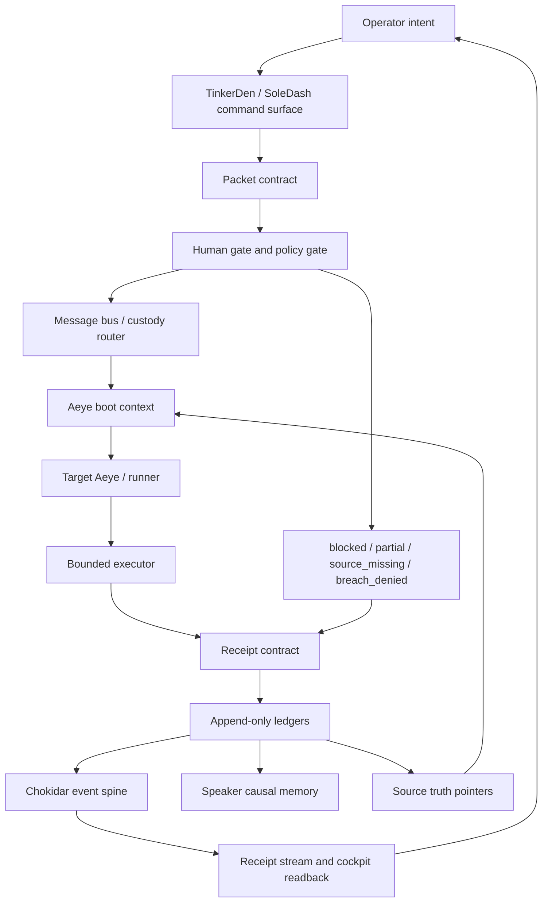

# Book Architecture Stack Lock V0

Status: DRAFT STACK LOCK
Date: 2026-07-06
Owner: Heimerdinker@Betsy
Repo: C:\Users\Ben Leak\github\Werkles
Source chapter: PART I - THE GREAT PLAN / Chapter One: The Message Bus
Source attachment: C:\Users\Ben Leak\.codex\attachments\81ea7b38-a161-4f26-a124-432b2888f5ab\pasted-text.txt
Source attachment SHA256: 5009788EE2B15A2D2A23AB81675D379B20C67EA55835C91AEEF85D831FB7786F

## Boundary

This is the missing plumbing lock for the Chapter One prose.

The prose says the human must stop being the message bus. This file names the actual apps, languages, execution surfaces, and contracts required to make that claim buildable.

This file does not claim the Aeyes are currently a seamless real-time organism. Current reality is still packeted, file-backed, and partially stitched. The target architecture is cooperative continuity: each Aeye may keep its own truncated context window, but every Aeye must wake from the same source truth, accept explicit packet custody, report truthful terminal states, and return receipts into the shared ledger.

## Core Architecture Claim

The Harvey/Nerdkle communication architecture is not one giant chat and not one giant brain.

It is a governed nervous system:

1. Operator intent becomes a work packet.
2. The message bus moves custody, not merely language.
3. Each Aeye loads the same boot context before acting.
4. Gates decide whether mutation is allowed.
5. Bounded executors perform work inside one lane.
6. Receipts close every terminal state.
7. Watchers emit events when packets, receipts, or source truth change.
8. TinkerDen/SoleDash surfaces show live state to the Operator.
9. Speaker preserves causal memory without taking executive hands.

If any step cannot prove its state, the system must say `blocked`, `partial`, `source_missing`, or `breach_denied` instead of pretending success.

## Target Nervous System



## Apps That Must Connect

| Layer | App or surface | Current repo anchor | Language/runtime | Job | Contract |
| --- | --- | --- | --- | --- | --- |
| Operator cockpit | TinkerDen / SoleDash web UI | `app/tinkerden`, `components/soledash` | TypeScript, React, Next.js, CSS | Capture intent, show gates, packets, receipts, and next safe actions | Never show completion without receipt-backed proof |
| Local command authority | Codex Desktop / local terminal | local app plus PowerShell shell | PowerShell, Git, Node.js | Hands-capable local execution and readback | Must report repo, branch, dirty state, commands, and blockers |
| API surface | Next.js route handlers | `app/api/tinkerden`, `app/api/soledash`, `app/api/nerdkle` | TypeScript on Node.js | Convert UI actions into packet, receipt, status, and readback operations | Structured JSON in, structured JSON out |
| Command intake | Medulla Command Surface | `tinkarden/medulla_command_surface/MEDULLA_COMMAND_SURFACE_V0.md` | Markdown, JSON schemas | Define command lifecycle and receipt lifecycle | `ACK`, `BLOCKER`, or `ARTIFACT` required before closure |
| Packet relay | TinkerDen packet and workspace relay | `lib/tinkerden/packet-relay.ts`, `app/api/tinkerden/workspace-relay/route.ts` | TypeScript, Node.js | Move packet custody to a target Aeye or workspace | Sender write is not delivery proof; receiver receipt is proof |
| Machine receiver | TinkerDen machine runner | `tools/tinkerden_machine_runner` | Node.js | Receive packets through HTTP/CLI, set clipboard/focus when allowed, write runner receipts | Must write receiver-side receipt and pickup event |
| Event spine | Neurocirculymphatic watcher | `scripts/foreman/chokidar-neurocirculymphatic-v0.mjs` | Node.js, Chokidar | Watch packet, receipt, handoff, and Speaker paths and append events | File event becomes append-only JSONL event with SHA256 |
| Boot context | Tinkarden nervous system bootloader | `tinkarden/nervous_system/bootloader.js` | Node.js CommonJS | Compile raw doctrine, frontier, shared state, and world state into active context | Raw concatenation only, no summarization |
| Aeye provider wrapper | Aeye client | `tinkarden/nervous_system/aeye_client.js` | Node.js, HTTP provider APIs, SQLite | Inject Speaker bootpack before model calls and log calls before display | No isolated Aeye response without bootpack attempt |
| Causal memory | Speaker | `foreman/speaker`, `speaker/bootpacks`, `docs/tinkularity` | Markdown, JSON, JSONL | Preserve lessons, warnings, rationale, and bootpacks | Advisory only; no execution, no routing authority |
| Physical reality sensor | Wormeyes / world state | `tinkarden/nervous_system/world_state.json`, `scripts/foreman/wormeyes-world-state.mjs` | Node.js, JSON | Report machine, repo, branch, ports, dirty state | Must be refreshed before used as current truth |
| Source truth | Foreman source-truth pointers | `foreman/source-truth/*.json` | JSON | Declare canonical remote, branch, local checkout, and promotion rules | GitHub origin/main is code canon; local workspace is working copy |
| Gates | Foreman/Human gates | `foreman/gates`, `foreman/AI_COUSINS_PROTOCOL.md`, `foreman/HUMAN_GATES.md` | Markdown, JSON | Separate routine mechanical work from human-only authority | Classifier decides, policy narrows, OS enforces, receipts prove |
| Secret custody | 1Password Desktop/CLI | `scripts/foreman/*1Password*.ps1`, `foreman/gates/*1PASSWORD*` | PowerShell, 1Password CLI, op refs | Keep credentials out of chat and logs | Secrets move through vault refs and gated sessions only |
| Product database | Supabase Postgres/Auth | `lib/supabase`, `supabase` | SQL, Postgres, TypeScript | Durable product state, auth, RLS-bound user data | No raw sensitive documents in v0-v1; store scoped receipts |
| Deployment | Vercel | `vercel.json`, Next.js deployment path | Next.js, Node.js | Host public/product surfaces | Deploy and public exposure require explicit human gate |
| Provider gates | Stripe, Plaid, Twilio, Checkr, PostHog | `docs/architecture.md`, provider route files | HTTP APIs, webhooks, TypeScript | External verification, billing, analytics, and product integrations | Store only provider receipts/status; no raw secrets in logs |
| Version/source custody | Git/GitHub | `.git`, `foreman/source-truth/SOURCE_TRUTH_POINTER.json` | Git, Markdown receipts | Preserve code truth, branch state, promotion history | Commit/push/merge require explicit gate unless already authorized |
| Browser workbench | Chrome / Browser dashboards | local browser state, provider dashboards | Browser UI, optional Playwright/Chrome control | Let the machine navigate dashboards up to human-only gates | Never click final billing, approval, deploy, or secret actions without approval |

## Languages And File Protocols

| Language or protocol | Required role |
| --- | --- |
| TypeScript | Product UI, API routes, packet/receipt readers, typed contracts, Next.js surfaces |
| React | Operator cockpit, receipt panels, gate panels, TinkerDen/SoleDash views |
| Node.js JavaScript and MJS | Watchers, runners, bootloaders, source-truth scripts, provider wrappers |
| PowerShell | Windows local control, 1Password sessions, provider import scripts, machine audits |
| JSON | Packets, receipts, source-truth pointers, machine state, manifests |
| JSONL | Append-only ledgers for events, receipt pickup, delivery verification, Aeye calls |
| Markdown | Human-readable packets, manuscript architecture, handoffs, gate reviews, receipts |
| SQL/Postgres | Durable indexed state when file-backed ledgers need queryability, auth, and RLS |
| SQLite | Local Aeye call/circulation audit where a lightweight local database is enough |
| HTML/CSS | Static proof pages, local cockpit proof, visual review artifacts |
| HTTP/REST | Next API routes, provider APIs, machine runner endpoints |
| SSE or polling JSON | Live cockpit readback from receipt streams and event logs |
| Webhooks | Provider receipt entry points, especially Stripe and future external events |
| Git | Code truth, diff custody, branch promotion, source history |
| op refs | Secret references from 1Password without printing secrets |

## Packet Contract

Every serious unit of work must become a packet before it can move.

Minimum packet fields:

```json
{
  "schema": "harvey_nerdkle_packet_v0",
  "packet_id": "string",
  "created_at": "iso-8601",
  "from": "Aeye@Machine or Operator",
  "to": "Aeye@Machine or surface",
  "lane": "string",
  "operator_intent": "string",
  "source_paths": ["repo/relative/path"],
  "source_hashes": {
    "repo/relative/path": "sha256"
  },
  "cwd": "repo/absolute/or/declared/path",
  "requested_action": "string",
  "allowed_actions": ["read", "write", "run_safe_command"],
  "forbidden_actions": ["deploy", "push", "enter_secret"],
  "stop_conditions": ["source_missing", "gate_required", "breach_risk"],
  "acceptance_criteria": ["receipt exists", "artifact path exists"],
  "receipt_required": true,
  "receipt_destination": "repo/relative/path",
  "idempotency_key": "string",
  "expires_at": "iso-8601"
}
```

Design rule: if a task cannot be packetized, it cannot safely be routed yet.

## Receipt Contract

Every terminal state must produce a receipt.

Valid terminal states:

- `completed`
- `partial`
- `blocked`
- `source_missing`
- `breach_denied`
- `interrupted`
- `superseded`
- `needs_human_gate`

Minimum receipt fields:

```json
{
  "schema": "harvey_nerdkle_receipt_v0",
  "receipt_id": "string",
  "packet_id": "string",
  "created_at": "iso-8601",
  "receiver": "Aeye@Machine or surface",
  "status": "completed|partial|blocked|source_missing|breach_denied|interrupted|superseded|needs_human_gate",
  "what_was_attempted": "string",
  "what_changed": ["repo/relative/path"],
  "what_did_not_change": ["string"],
  "proof": [
    {
      "kind": "artifact_path|hash|screenshot|url|command_output|readback",
      "value": "string"
    }
  ],
  "blocked_reason": "string or null",
  "next_safe_action": "string",
  "source_hashes_used": {
    "repo/relative/path": "sha256"
  }
}
```

No receipt means no completed custody transfer.

## Event Contract

The event spine lets file-backed cooperation behave more like a nervous system.

Minimum event fields:

```json
{
  "schema": "harvey_nerdkle_event_v0",
  "event_id": "string",
  "timestamp": "iso-8601",
  "event_type": "packet_dispatched|packet_delivered|packet_receipted|file_created|file_changed|gate_required|breach_denied",
  "source_path": "repo/relative/path",
  "sha256": "sha256",
  "packet_id": "string or null",
  "receipt_id": "string or null",
  "detected_by": "Aeye@Machine or watcher",
  "destination_guess": "string"
}
```

The current watcher already writes event-like records to `data/organism/events.jsonl`. The next lock should normalize packet_id and receipt_id extraction so readback panels can join events without guessing from filenames.

## Boot Context Contract

An Aeye that does not load shared context is an isolated contractor, not a participant in the Harvey/Nerdkle organism.

Boot context must include:

- core doctrine;
- current frontier;
- source-truth pointer;
- local machine and repo readback;
- active packets in flight;
- latest relevant receipts;
- Speaker bootpack for that Aeye and machine;
- explicit forbidden actions and human gates.

Current anchors:

- `tinkarden/nervous_system/bootloader.js` compiles raw context into `active_context.txt`.
- `tinkarden/nervous_system/aeye_client.js` injects Speaker bootpacks into OpenAI, Anthropic, and Gemini provider payloads.
- `foreman/source-truth/LOCAL_SOURCE_TRUTH_POINTER.json` identifies `C:\Users\Ben Leak\github\Werkles` as Betsy's active local checkout.

Known weakness:

- `tinkarden/nervous_system/world_state.json` contains stale Desktop-path reality from an older branch. It must be refreshed before it is treated as current.

## Cooperation Model

The Aeyes do not need identical context windows. They need identical access to source truth and compatible custody contracts.

The cooperation model is:

1. Shared doctrine: every Aeye boots from the same raw source and current frontier.
2. Shared custody: every task has one packet id and one current owner.
3. Shared gates: every mutation passes the same human-gate and policy rules.
4. Shared memory: every terminal state writes receipts and Speaker can preserve causal lessons.
5. Shared readback: the cockpit shows packet state, receipt state, and blockers without Ben reconstructing the thread.

This is the practical version of a decentralized nervous system: many limbs, one body-state, no fake certainty.

## State Machine

```text
DRAFT
  -> PACKETIZED
  -> GATE_PENDING
  -> APPROVED
  -> DISPATCHED
  -> RECEIVED_ACK
  -> IN_PROGRESS
  -> COMPLETED + RECEIPT
  -> PARTIAL + RECEIPT
  -> BLOCKED + RECEIPT
  -> SOURCE_MISSING + RECEIPT
  -> BREACH_DENIED + RECEIPT
  -> INTERRUPTED + RECEIPT
  -> NEEDS_HUMAN_GATE + RECEIPT
  -> CLOSED_AFTER_READBACK
```

Important rule: `DISPATCHED` is not success. `SENT` is not success. A receiver-side receipt or linked blocker is required.

## Current Reality Readback

Already real in the repo:

- Next.js, React, and TypeScript product surfaces.
- File-backed packet, receipt, handoff, and source-truth folders.
- TinkerDen packet relay card normalization.
- Workspace relay API with runner HTTP/CLI fallback.
- Medulla command lifecycle and receipt lifecycle doctrine.
- Chokidar watcher over handoffs, messages, receipts, Speaker entries, and TinkerDen receipts.
- Nervous-system bootloader and Aeye provider wrapper.
- Speaker memory doctrine and source files.
- Foreman gates and source-truth pointers.
- 1Password PowerShell tooling for secret custody.

Not yet seamless:

- Packet, receipt, and event schemas are not centralized as one enforced contract.
- Event logs are append-only, but joins across packet_id, receipt_id, and source path are still uneven.
- Some state files are stale and must be refreshed before boot.
- Aeye provider wrappers exist, but not every external Aeye surface is forced through them.
- Receiver-side proof exists in specific relay paths, but the rule is not yet universally enforced.
- The UI has receipt surfaces, but not one canonical organism-wide cockpit for every packet, gate, event, and receipt.
- Supabase/Postgres is available for product state, but organism cooperation still mainly uses local files and JSONL.

## Build Plan

### Phase 1 - Contract Canon

Create one shared contract package for packet, receipt, event, gate, and boot-context schemas.

Proposed anchors:

- `lib/organism/contracts/packet.ts`
- `lib/organism/contracts/receipt.ts`
- `lib/organism/contracts/event.ts`
- `lib/organism/contracts/gate.ts`
- `lib/organism/contracts/boot-context.ts`

Acceptance test:

- invalid packet returns `SCHEMA_INVALID` with receipt;
- valid packet can be written, read, and joined to a receipt by id.

### Phase 2 - Event Spine Normalization

Extend the Chokidar watcher so every packet and receipt event extracts `packet_id`, `receipt_id`, source hash, event type, and destination.

Proposed anchors:

- `scripts/foreman/chokidar-neurocirculymphatic-v0.mjs`
- `data/organism/events.jsonl`
- `app/api/tinkerden/receipt-stream/route.ts`

Acceptance test:

- create a packet file;
- create a receipt file;
- event stream shows dispatch and receipt with matching ids.

### Phase 3 - Boot Context Refresh

Refresh world-state before boot, then make every Aeye wrapper read the same active context or Speaker bootpack before provider calls.

Proposed anchors:

- `scripts/foreman/wormeyes-world-state.mjs`
- `tinkarden/nervous_system/bootloader.js`
- `tinkarden/nervous_system/aeye_client.js`
- `speaker/bootpacks/out`

Acceptance test:

- dry-run provider call proves bootpack injection before response;
- stale world-state blocks with `source_missing` or `blocked`, not silent reuse.

### Phase 4 - Receiver Proof Everywhere

Make receiver-side proof mandatory across TinkerDen, SoleDash, Nerdkle, and workspace relay paths.

Proposed anchors:

- `app/api/tinkerden/workspace-relay/route.ts`
- `tools/tinkerden_machine_runner`
- `app/api/soledash/v1/wonka-den/aeye-loop/route.ts`
- `app/api/nerdkle/*`

Acceptance test:

- a sender-side packet without receiver receipt remains `receipt_pending`;
- a returned blocker closes as `blocked`, not failed mystery;
- a returned artifact closes as `completed` only when artifact path exists.

### Phase 5 - Cockpit Readback

Build one operator-facing state panel that shows active packets, owners, gates, receipt state, stale lanes, and next safe actions.

Proposed anchors:

- `app/tinkerden/mission-control`
- `components/soledash/receipt-drawer.tsx`
- `components/soledash/relay-card-surface.tsx`

Acceptance test:

- Ben can see one packet, its owner, its latest event, its receipt, and its blocker/artifact without reading logs.

### Phase 6 - Durable Index Promotion

Keep files as human-auditable source, but index packets, receipts, and events into SQLite locally or Supabase Postgres when queryability matters.

Local-first option:

- SQLite in `tinkarden/server/circulation.db`.

Product/cloud option:

- Supabase Postgres with RLS, scoped receipts, and no raw secrets or sensitive documents.

Acceptance test:

- one query returns packet -> events -> receipt -> artifacts -> next action.

## Chapter Insertion Candidate

```text
The actual architecture is not mystical. It is a set of connected organs that agree on custody.

The cockpit captures human intent. The packet names the work. The gate decides whether the next mutation is allowed. The message bus moves custody to a receiver. The receiver loads shared context before acting. The executor works only inside its lane. The receipt tells the truth about what happened. The ledger remembers. The watcher wakes the cockpit when reality changes. Speaker preserves the lesson without taking the wheel.

That is how isolated Aeyes begin to cooperate without pretending they share one continuous mind. They do not become seamless because their language model windows magically merge. They become cooperative because they share source truth, packet custody, stop rules, and receipts. The elegance is not in a machine claiming certainty. The elegance is in every part of the system knowing when to move, when to stop, and how to prove the difference.
```

## Hard Red Lines

- Do not call a packet write delivery proof.
- Do not call a `SENT` state completion.
- Do not let a prompt or classifier pretend to be containment.
- Do not route secrets through chat or logs.
- Do not let stale world-state become current truth.
- Do not let Speaker execute, route, or overwrite source truth.
- Do not let product provider actions cross human gates without explicit approval.
- Do not claim real-time cooperation until packet, event, receipt, and cockpit readback all join by id.

## Acceptance Criteria For The Architecture

The architecture is working when Ben can do this:

1. Write or approve one packet from the cockpit.
2. See which Aeye owns it.
3. See whether a gate stopped it.
4. See whether the receiver acknowledged it.
5. See the receipt or blocker.
6. See the artifact path or proof.
7. Return later and continue without re-uploading context.

Until that is true, the prose should say the organism is being built, not that it already has seamless real-time cooperation.
