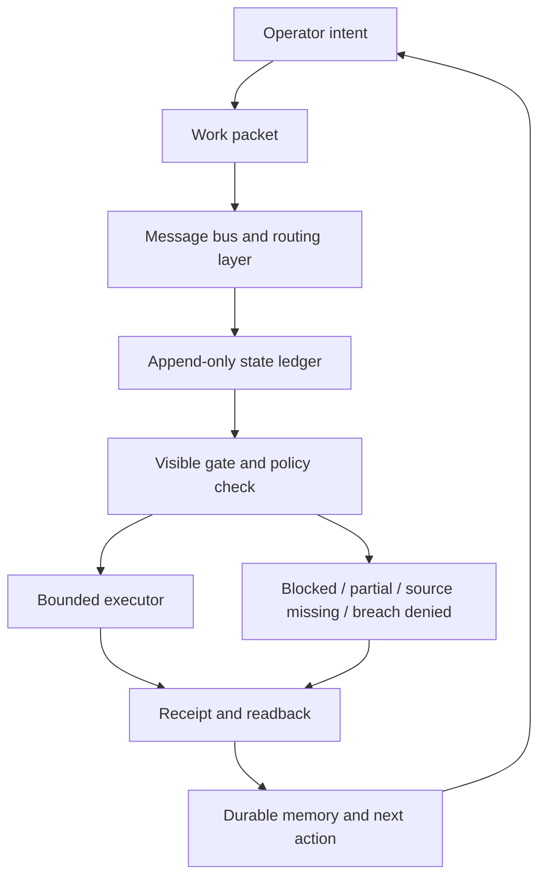

# Chapter 01 Message Bus Architecture

Status: ARCHITECTURE COMPANION DRAFT
Date: 2026-07-05
Owner: Heimerdinker@Betsy
Source chapter: PART I - THE GREAT PLAN / Chapter One: The Message Bus
Source attachment hash: 8D38232166B8A4ADF569A3AB86C6C7D1DF1E18C6FA6177504DBEEEF9E1F7E647

## Boundary

This file does not edit the manuscript chapter. It is a coauthor architecture companion for the chapter Ben provided on 2026-07-05.

The missing `BOOK_ARCHITECTURE_STACK_LOCK_V0` source is still not recovered. Therefore this companion does not invent an exact global stack lock. It gives the chapter-level architecture that the prose is already pointing toward: a governed message bus that removes Ben from transport labor without handing the workspace to blind automation.

## Chapter Function

This chapter should do four jobs.

1. Make the reader feel the real injury: the creator has become the transport layer for their own tools.
2. Reject the fake cure: brittle automation that moves fast without context, honesty, or containment.
3. Introduce the true requirement: autonomous momentum with auditable state, hard stop conditions, and receipts.
4. Establish the proof rule: prose can explain the system, but manifests, ledgers, code, and receipts decide what the system actually is.

The chapter is strongest when it does not become a product manual. Its job is to name the human burden and reveal the shape of the remedy. The exact components can live in appendix or architecture lock files.

## Core Claim

The problem is not that creators lack more tools. The problem is that tools do not share a durable operational truth.

Without that shared truth, the human becomes the message bus:

- carrying context between chats, terminals, browsers, dashboards, and files;
- remembering which source is current;
- reconstructing why a decision was made;
- authorizing the same boundary again and again;
- translating failure into the next useful action.

The remedy is not blind autonomy. The remedy is governed continuity: work packets, routing, state ledgers, visible gates, execution boundaries, and receipts.

## Argument Architecture

### 1. Diagnosis: The Human As Transport Wire

The opening frame should stay visceral and specific. The reader needs to recognize themselves in the mule work:

- copy from terminal to config;
- paste from chat to tool;
- hunt old threads;
- repair environment variables;
- reauthorize access;
- remember what the system forgot.

This establishes the human cost before the architecture appears. It prevents the chapter from sounding like a software proposal.

### 2. False Solution: Thoughtless Automation

The chapter correctly refuses the naive answer: "just automate it."

The architectural reason is simple. Automation without state integrity is merely faster drift.

Bad automation fails in two ways:

- it freezes silently and pretends the lane is clean;
- it loops destructively because it cannot recognize a boundary.

This is where the chapter should make the distinction between speed and trust. A fast tool that cannot stop is not an assistant. It is an unattended hazard.

### 3. True Solution: Autonomous Momentum

The desired system does not replace the operator. It removes transport labor from the operator.

Autonomous momentum means the workspace can keep its own state warm:

- what work packet is active;
- what lane owns it;
- what source files it depends on;
- what commands are allowed;
- what has been completed;
- what is blocked;
- what proof exists;
- what should happen next.

The operator still sets ends. The organism serves means.

### 4. Proof Rule: Plumbing Wins

The chapter lands well because it names the boundary between myth and mechanism.

The reader-facing doctrine:

> If prose and plumbing disagree, patch the prose or patch the plumbing, then demand a receipt.

The architecture rule:

- prose explains;
- manifests declare;
- ledgers remember;
- gates decide;
- the OS enforces;
- receipts prove.

## System Layers Under The Metaphor



### Operator Intent Layer

This is the Elwood seat: human intention, preference, taste, values, risk tolerance, and destination.

The machine must not rank dreams. It can help compare means, consequences, constraints, and evidence. It cannot decide which future deserves to exist.

### Work Packet Layer

The work packet replaces the human as context courier.

A real packet needs:

- packet id;
- lane;
- owner;
- source paths;
- acceptance criteria;
- allowed actions;
- stop conditions;
- required receipt shape.

If a task cannot be packetized, the system cannot safely route it yet.

### Message Bus And Routing Layer

The message bus is not just chat. Chat is conversational memory. The message bus is operational custody.

It must preserve:

- who sent the work;
- who received it;
- what exact packet was received;
- whether the receiver acknowledged custody;
- where the receipt landed;
- whether a human still needs to act.

This is the layer that stops Ben from being the living bridge between tools.

### State Ledger Layer

The ledger is where reality is allowed to stay ugly.

Allowed states are not only success states:

- completed;
- partial;
- blocked;
- source missing;
- breach denied;
- interrupted;
- superseded;
- needs human gate.

The point is not emotional optimism. The point is state truth.

### Gate And Policy Layer

This is where the chapter must avoid overclaiming.

A classifier or preflight check is not containment by itself. The safe framing is:

- classifier decides;
- policy narrows;
- the OS enforces;
- receipt proves.

If a lane is unsafe, the gate must stop the action before mutation. If the gate cannot enforce the boundary, the architecture must say so.

### Executor Layer

The executor performs bounded work. It should not improvise scope.

It needs:

- current working directory;
- command allowlist or explicit permission model;
- file boundary;
- rollback or non-destructive default;
- timeout;
- clear failure state;
- no secret printing.

This turns autonomy from "go do everything" into "move one lane forward while preserving evidence."

### Receipt And Readback Layer

Receipts are the antidote to fake completion.

A receipt should answer:

- What was attempted?
- What changed?
- What did not change?
- What proof was observed?
- What remains blocked?
- Where is the artifact?

The receipt lets the operator return to the desk without reconstructing the entire night from chat dust.

## Reader-Facing Architecture Passage Candidate

This is a possible insertion after "The Demand for Autonomous Momentum" or immediately before "The Ground Rules."

```text
Underneath the metaphor, the answer is brutally concrete.

The human cannot remain the message bus because a nervous system is not a ledger. A person can remember, infer, forgive, improvise, and carry meaning across broken gaps, but those gifts are precisely why the arrangement is so dangerous. The more capable the operator becomes, the more the broken system learns to lean on them. Competence becomes load-bearing. Memory becomes infrastructure. Taste becomes an undocumented API.

The replacement cannot be a single giant brain bolted onto the workspace. That would only move the bottleneck from one exhausted human mind into one unaccountable machine loop. The replacement has to be a governed transport layer.

Every serious unit of work must become a packet. A packet says what is being attempted, who owns the lane, which sources are authoritative, what actions are allowed, what counts as done, and where proof must land. Once work is packetized, it can move without requiring the human to serve as a living bridge between tools.

Every packet must pass through a gate. The gate is not a vibe check. It is the boundary between intention and mutation. It asks whether the action is in the right lane, whether the source exists, whether the command is allowed, whether secrets are about to leak, whether the machine is about to pretend certainty it does not have. If the answer is no, the system does not get creative. It stops.

Every stop must become a receipt. Completed is a receipt. Blocked is a receipt. Partial is a receipt. Source missing is a receipt. Breach denied is a receipt. The system earns trust not by succeeding all the time, but by preserving the truth of what happened when it did not succeed.

That is the architectural difference between a mule loop and a cooperative organism. In the mule loop, the human carries state because the tools cannot. In the organism, state is externalized into packets, ledgers, gates, and receipts. The human remains sovereign over ends. The machine layer carries the means.

This is not magic. It is not consciousness. It is not a machine wanting your dream for you. It is transport plumbing finally becoming honest enough that the operator can stop living inside the wire.
```

## Red-Team Notes

### Risk: "Tools do not communicate" is too absolute

Many tools communicate through APIs, integrations, webhooks, and files. The sharper claim is that they lack a shared durable operational truth. That is harder to dismiss and more architecturally precise.

Suggested phrasing:

```text
The tools can exchange data. What they cannot reliably share is custody, context, authority, and proof.
```

### Risk: "Hardcoded honesty" can overpromise

The chapter says the organism is hardcoded to recognize states like blocked and source missing. That works as doctrine, but it needs architectural humility.

Safer framing:

```text
The system is designed so that these states are first-class outcomes, not embarrassing exceptions to be smoothed away.
```

### Risk: The organism can sound like it has ends

Do not let "organism" imply independent desire. The machine layer is a means-serving structure.

Keep:

```text
The operator sets ends. The organism serves means.
```

Cut or revise anything that implies:

- the system wants;
- the system chooses values;
- the system decides whose future matters.

### Risk: Message bus may sound like another chat app

The chapter should distinguish conversational exchange from operational custody.

Good line:

```text
Chat is where language moves. The message bus is where custody moves.
```

### Risk: Full spec creep

Do not list too many product components in the main chapter. Keep named internal organs in appendices or later proof chapters.

Chapter One should explain the need for:

- packets;
- ledgers;
- gates;
- receipts.

It does not need to name every local subsystem.

## Keep / Cut Rules

Keep:

- human burden first;
- automation critique second;
- architecture as remedy third;
- receipts/manifests/code win over prose;
- operator sovereignty over ends.

Cut:

- component catalogs in the chapter body;
- claims of consciousness;
- claims that watchers are containment;
- vague "AI will handle it" language;
- any success claim without receipt language.

## Chapter-Level Acceptance Criteria

The chapter architecture is working if a reader can answer:

1. What human burden is being removed?
2. Why is blind automation not acceptable?
3. What does a trustworthy transport layer have that current tools lack?
4. How does the system know when to stop?
5. How does the operator verify what happened?
6. Why does the human still own the ends?

If those answers are clear, the chapter can carry architecture without becoming a manual.

## Next Coauthor Move

Draft a tighter version of "The Ground Rules" that makes the proof rule more elegant:

- prose is treaty;
- manifests are law;
- receipts are evidence;
- code is enforcement;
- human gates are sovereignty.

Do that only after Ben confirms whether this chapter should stay under "The Message Bus" or merge with the existing Chapter One workbench artifact "The Human Infrastructure Problem."
