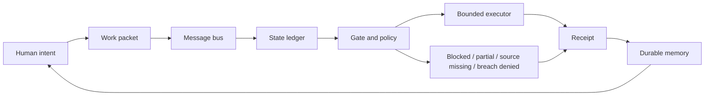

# Chapter 01 Message Bus HLD

Status: HIGH LEVEL DESIGN
Date: 2026-07-05
Owner: Heimerdinker@Betsy
Source: User-provided Chapter One source, "The Message Bus"
Source attachment hash: 61307BC64AA346DD1126B384EB4C1735D6B588024AC2400BDB81CF63AFB8D68A

## Purpose

This HLD translates Chapter One into the simplest architecture the chapter needs to carry.

The chapter's design target is not "build an AI agent." The target is: remove the human from the message-bus role without creating blind automation.

The system must let work move between tools, agents, files, and humans while preserving custody, state, authority, and proof.

## Reader Promise

By the end of Chapter One, the reader should understand:

1. Why the creator currently acts as the transport layer.
2. Why naive automation is not a trustworthy cure.
3. What kind of infrastructure can carry work safely.
4. Why truthful stop states are part of autonomy, not failure.
5. Why the human still owns ends while the machine carries means.

## Non-Goals

Chapter One should not:

- list the entire product stack;
- explain every local subsystem;
- claim the machine has its own desires;
- imply that chat history is a sufficient message bus;
- imply that a classifier is the containment wall;
- promise autonomy without receipts.

## Core HLD Statement

```text
The human stops being the message bus when work becomes packetized, routed, gated, executed within boundaries, and closed by receipt.
```

## High-Level Components



### 1. Human Intent

The human chooses ends, taste, values, appetite for risk, and destination.

The system may organize means. It must not rank the human's dreams.

### 2. Work Packet

The packet is the replacement for human context-carrying.

Minimum fields:

- packet id;
- origin;
- destination;
- lane;
- source paths;
- requested action;
- allowed actions;
- stop conditions;
- acceptance criteria;
- required receipt.

### 3. Message Bus

The message bus moves custody, not just language.

It must answer:

- Who sent the work?
- Who accepted it?
- Which packet was received?
- Where is the current state?
- Where did the receipt land?
- What still needs a human?

### 4. State Ledger

The ledger preserves working reality across interruptions.

Allowed states:

- queued;
- accepted;
- in progress;
- completed;
- partial;
- blocked;
- source missing;
- breach denied;
- superseded;
- needs human gate.

Design rule: blocked is a valid state, not a shameful exception.

### 5. Gate And Policy

The gate decides whether the next action is allowed.

The safe formulation:

```text
Classifier decides. Policy narrows. OS enforces. Receipts prove.
```

Chapter One should not claim that a watcher, classifier, or prompt is the containment wall. The containment wall must be enforced by the execution boundary.

### 6. Bounded Executor

The executor does work only inside the allowed lane.

It requires:

- cwd;
- file boundary;
- command policy;
- timeout;
- no-secret-output rule;
- non-destructive default;
- explicit mutation proof.

### 7. Receipt

The receipt closes the loop.

Receipt must say:

- what was attempted;
- what changed;
- what did not change;
- what evidence proves it;
- what state remains;
- what next action is safe.

No receipt means no completed custody transfer.

## State Machine

```text
QUEUED
  -> ACCEPTED
  -> IN_PROGRESS
  -> COMPLETED + RECEIPT
  -> PARTIAL + RECEIPT
  -> BLOCKED + RECEIPT
  -> SOURCE_MISSING + RECEIPT
  -> BREACH_DENIED + RECEIPT
  -> NEEDS_HUMAN_GATE + RECEIPT
```

The important move for the chapter: all terminal states produce receipts. Success is not the only legitimate output.

## Chapter Mapping

| Chapter section | Architecture carried |
| --- | --- |
| Data mule opening | Human is current transport layer |
| Hidden infrastructure tax | State and routing live in the human nervous system |
| Thoughtless automation | Unbounded executor without state truth |
| Autonomous momentum | Packet, ledger, gate, receipt loop |
| Elwood and Harvey paradigm | Human owns ends, machine carries means |
| Ground Rules | Prose explains; manifests/code/receipts decide |

## Tight Insert Candidate

This is the short HLD-grade passage if the chapter needs one clean architectural bridge:

```text
The architecture underneath this argument is simple: every serious unit of work must stop being a memory in someone's head and become a packet in a governed transport system. The packet carries intent, source, lane, authority, stop conditions, and proof requirements. The message bus moves custody between tools and agents. The ledger preserves state. The gate decides whether the next mutation is allowed. The bounded executor acts only inside the permitted lane. The receipt records what happened.

That loop is the difference between cooperation and chaos. It gives the system momentum without pretending that momentum is judgment. Completed, blocked, partial, source missing, and breach denied are all real outcomes because all of them preserve truth. The human is no longer forced to carry the wire between tools, but the human still owns the destination. The machine carries means. The operator keeps ends.
```

## Red-Team Guardrails

1. Replace "tools do not communicate" with the sharper claim: tools do not share durable custody, context, authority, and proof.
2. Do not say the organism is conscious or has desires.
3. Do not treat automation speed as autonomy.
4. Do not treat a classifier or watcher as containment.
5. Do not let the architecture section become a component catalog.
6. Keep the proof rule close to the prose: if manuscript myth and system plumbing disagree, patch one and demand receipt.

## Acceptance Criteria

The Chapter One HLD is ready if it can be summarized in one sentence:

```text
The message bus replaces human transport labor with packetized custody, truthful state, bounded execution, and receipts while preserving human sovereignty over ends.
```

If a reader can carry that sentence forward, the chapter has done its architectural job.
